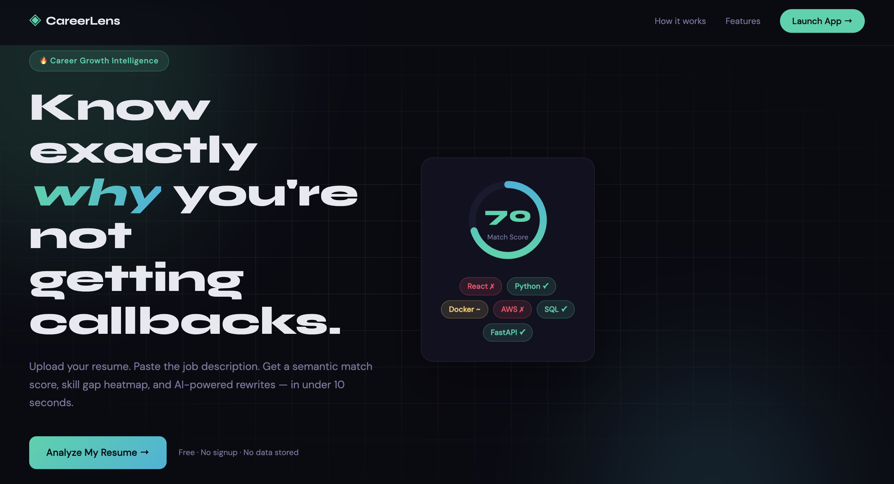
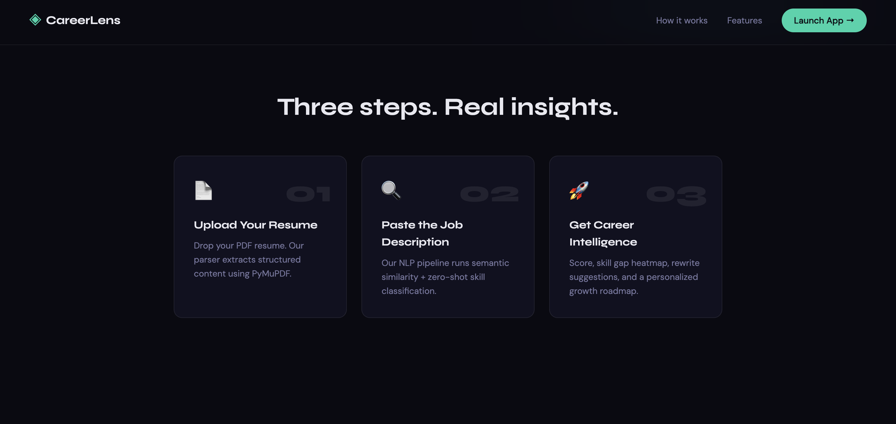
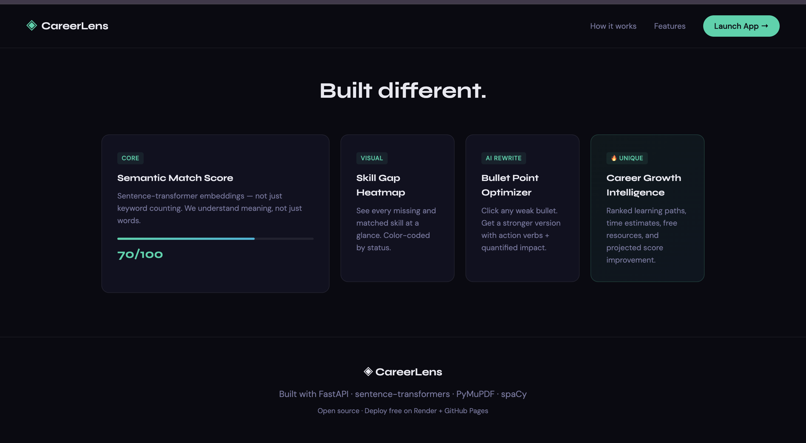
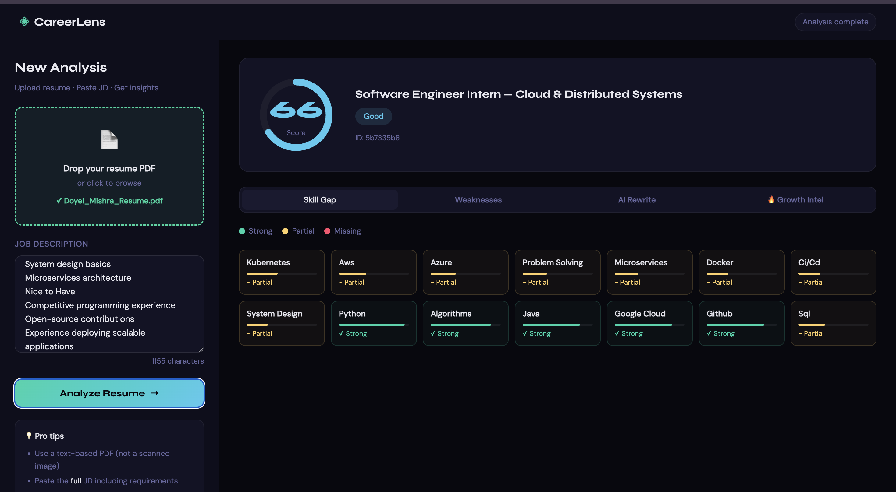

# ◈ CareerLens
### AI-Powered Career Intelligence & Resume Optimization Platform

---

## 🚀 Live Demo

**🌐 Live App:** [careerlens-ai-7fy5.onrender.com](https://careerlens-ai-7fy5.onrender.com)

> ⚡ Hosted on Render free tier — may take 30–50s to wake up on first load.

---

## 📸 Screenshots

### Landing Page


### How It Works


### Feature Overview


### Dashboard — Skill Gap Analysis


---

## ✨ Features

| Feature | Description |
|---|---|
| **Semantic Match Score** | sentence-transformers cosine similarity — understands meaning, not just keywords |
| **Skill Gap Heatmap** | Visual grid of strong / partial / missing skills with confidence bars |
| **Resume Weakness Detector** | Heuristic analysis: missing metrics, weak verbs, short resume, missing sections |
| **AI Bullet Rewriter** | One-click rewrite with strong verbs, quantification, and JD keyword injection |
| **🔥 Career Growth Intelligence** | Ranked learning paths, free resources, time estimates, projected score improvement |

---

## 🏗️ Architecture

```
careerlens/
│
├── backend/
│   ├── main.py                  # FastAPI app, CORS, static serving
│   ├── requirements.txt
│   │
│   ├── routers/
│   │   ├── analyze.py           # POST /api/analyze  (PDF + JD → full analysis)
│   │   ├── rewrite.py           # POST /api/rewrite  (bullet → AI rewrite)
│   │   └── insights.py          # POST /api/insights (missing skills → roadmap)
│   │
│   ├── services/
│   │   ├── model_manager.py     # Singleton model cache (load once, reuse)
│   │   ├── parser.py            # PyMuPDF PDF extraction + section detection
│   │   ├── scorer.py            # Semantic similarity with sentence-transformers
│   │   ├── gap_analyzer.py      # Skill taxonomy + hybrid keyword/semantic matching
│   │   ├── suggestion_engine.py # Rule-based bullet rewriting
│   │   └── career_insights.py  # Career Growth Intelligence engine
│   │
│   └── models/
│       └── schemas.py           # Pydantic request/response models
│
├── frontend/
│   ├── templates/
│   │   ├── index.html           # Landing page
│   │   └── dashboard.html       # Main app
│   └── static/
│       ├── css/
│       │   ├── index.css
│       │   └── dashboard.css
│       └── js/
│           ├── index.js
│           └── dashboard.js
│
├── preload_models.py            # One-time model download script
├── setup.sh                     # One-command setup
├── Dockerfile
└── render.yaml                  # Render free-tier deploy config
```

### Data Flow

```
User uploads PDF + JD
        ↓
FastAPI /api/analyze
        ↓
asyncio.gather([
    extract_text_from_pdf()      # PyMuPDF — sync in thread pool
    detect_resume_sections()     # spaCy heuristics
    compute_match_score()        # sentence-transformers cosine sim
    extract_job_title()          # regex + heuristics
])
        ↓
asyncio.gather([
    analyze_skill_gaps()         # hybrid keyword + semantic
    detect_resume_weaknesses()   # rule-based
])
        ↓
AnalyzeResponse (JSON)
        ↓
Frontend renders:
  • Animated score ring
  • Skill heatmap
  • Weakness cards
  • Bullet rewriter
  • Career Growth Intel
```

---

## ⚡ ML Stack

| Model | Purpose | Size | Speed (CPU) |
|---|---|---|---|
| `all-MiniLM-L6-v2` | Semantic similarity | ~90MB | ~150ms/pair |
| `cross-encoder/nli-MiniLM2-L6-H768` | Zero-shot skill classification | ~120MB | ~200ms |
| `en_core_web_sm` | NLP / NER | ~12MB | ~5ms |
| PyMuPDF | PDF text extraction | — | ~50ms |

**Total cold start:** ~8s (model loading) — **Warm requests: < 2s**

---

## 🛠️ Local Setup

### Prerequisites
- Python 3.10+
- pip

### 1. Clone

```bash
git clone https://github.com/yourusername/careerlens.git
cd careerlens
```

### 2. One-command setup

```bash
chmod +x setup.sh
./setup.sh
```

This creates a venv, installs all deps, and downloads the spaCy model.

### 3. Pre-download ML models (recommended)

```bash
source venv/bin/activate
python preload_models.py
```

### 4. Run

```bash
cd backend
python main.py
```

Open **http://localhost:8000** in your browser.

### API Docs

FastAPI auto-generates interactive docs at: **http://localhost:8000/api/docs**

---

## 🌐 Deploy Free

### Option A: Render (Recommended — full backend)

1. Push to GitHub
2. Go to [render.com](https://render.com) → New → Web Service
3. Connect your repo
4. Render auto-detects `render.yaml`
5. Deploy — free tier gives you 512MB RAM, perfect for these models

### Option B: Docker (anywhere)

```bash
docker build -t careerlens .
docker run -p 8000:8000 careerlens
```

### Option C: GitHub Codespaces

1. Open repo in Codespaces
2. Run `./setup.sh`
3. `cd backend && python main.py`
4. Forward port 8000 → open in browser

---

## 🧪 API Reference

### `POST /api/analyze`
Accepts `multipart/form-data`:
- `resume`: PDF file
- `job_description`: string (min 50 chars)

Returns: match score, skill gaps, weaknesses, job title.

### `POST /api/rewrite`
```json
{
  "bullet_point": "Responsible for backend development",
  "job_description": "...",
  "context": "Experience"
}
```
Returns: original, rewritten, improvement reason, keywords.

### `POST /api/insights`
```json
{
  "missing_skills": ["Docker", "AWS", "Kubernetes"],
  "resume_score": 52.3,
  "job_title": "Senior Backend Engineer"
}
```
Returns: learning paths, projected score, career tips, market insight.

---

## 💼 Resume Value

This project demonstrates:

- **Real ML/NLP** — sentence-transformers, zero-shot classification, spaCy
- **Async Python** — `asyncio.gather` for concurrent ML inference
- **Production FastAPI** — routers, Pydantic v2, multipart upload, thread pools
- **System design** — singleton model cache, service layer separation
- **Frontend engineering** — vanilla JS SPA with animated SVG, tab routing, async fetch
- **DevOps** — Dockerfile, Render deploy config, one-command setup

---

## 🔧 Tech Stack

**Backend:** Python · FastAPI · sentence-transformers · transformers · PyMuPDF · spaCy · Pydantic v2 · uvicorn  
**Frontend:** HTML5 · CSS3 · Vanilla JavaScript  
**Fonts:** Syne · DM Sans (Google Fonts)  
**Deploy:** Render (free) · Docker  

---

## 📄 License

MIT — free to use, modify, and deploy.

---

*Built with ◈ CareerLens — where AI meets career intelligence.*
